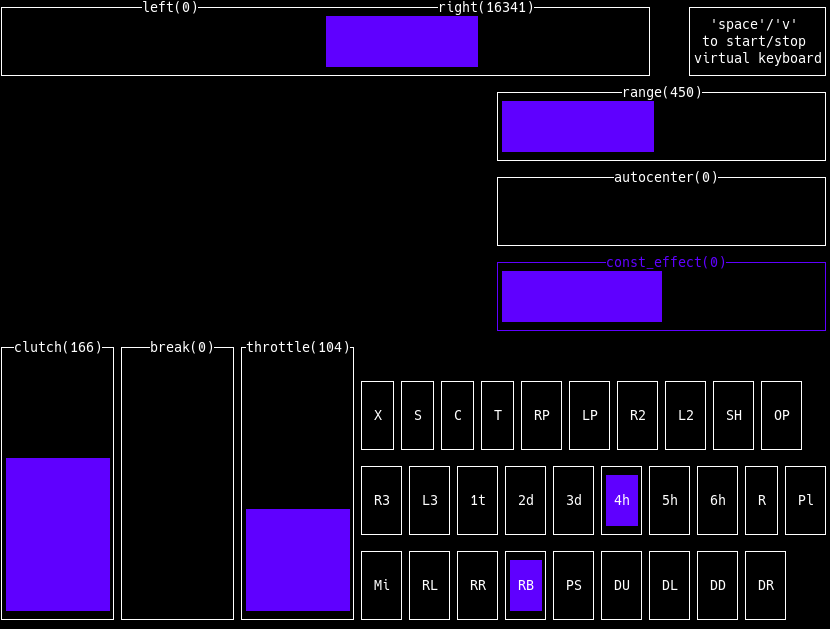

# A small Logitech G29 TUI tool



> [!NOTE]
> I have tested this only on my system and device so im not certain
> that it will work on others.

## Features
- view button/axes state
- manage wheel range
- autocenter & constant effects
- virtual device for maping wheel to keyboard buttons


## Virtual Keyboard

- config file path: `~/go29` or `~/.config/go29`
- example can be found in the repo in `exampleConfig`

## Bulding

*you will need `libudev` that should come with `systemd-libs`*

`go bulid`

- or run with: `go run go29`

## Nix
There is a flake output available.
You can just run it like this: \
`nix run github:crolbar/go29`

or install:

```nix
inputs.go29.url = "github:crolbar/go29";
....
environment.systemPackages = [inputs.go29.packages.x86_64-linux.default];
```
